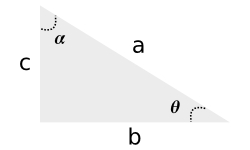

% Física II - Cheat Sheets
% Átila Camurça

# Vetores

São representados por segmentos orientados e são caracterizados por

1. Módulo
1. Direção
1. Sentido

O módulo de um vetor $\vec{u} = (u_1, u_2)$ é dado por:

$$
|\vec{u}| = \sqrt{u_1^2 + u_2^2}
$$

## Soma de Vetores

O resultado é um outro vetor com origem na origem do primeiro e extremidade
na extremidade do último.

### Propriedades da Soma

#### Comutatividade

$$
\vec{v} + \vec{w} = \vec{w} + \vec{v}
$$

#### Associatividade

$$
\vec{u} + (\vec{v} + \vec{w}) = (\vec{u} + \vec{v}) + \vec{w}
$$

#### Existência do elemento Neutro

$$
\vec{v} + 0 = 0 + \vec{v} = \vec{v}
$$

#### Existência do elemento inverso da soma

$$
\vec{v} + (-\vec{v}) = 0
$$

## Multiplicação de um vetor por um escalar

Seja $\alpha$ um número real não-nulo e $\vec{v}$ um vetor. Dizemos que $\alpha \vec{v}$:

1. Módulo: $|\alpha|$
2. Direção: mesma de $\vec{v}$
3. Sentido:
	* mesmo sentido de $\vec{v}$ se $\alpha > 0$
	* sentido oposto caso contrário

### Propriedades da multiplicação por escalar

#### Associatividade

$$
\alpha (\beta \vec{v}) = (\alpha \beta) \vec{v}
$$

#### Distributividade

$$
\alpha (\vec{v} + \vec{w}) = \alpha \vec{v} + \alpha \vec{w}
$$

$$
(\alpha + \beta) \vec{v} = \alpha \vec{v} + \beta \vec{v}
$$

## Produto Escalar

Também conhecido como Produto Interno, é denotado por $\vec{v} \cdot \vec{w}$, e
definido por

$$
\vec{v} \cdot \vec{w} = v_1 w_1 + v_2 w_2
$$

Quando $\vec{v}$ e $\vec{w}$ são vetores no plano, e

$$
\vec{v} \cdot \vec{w} = v_1 w_1 + v_2 w_2 + v_3 w_3
$$

Quando $\vec{v}$ e $\vec{w}$ são vetores no espaço.

### Teorema

$$
\vec{v} \cdot \vec{w} = |\vec{v}| |\vec{w}| \cos \theta
$$

Onde $\theta$ é o ângulo entre estes vetores.

Daí temos também que

$$
\cos \theta = \frac{\vec{v} \cdot \vec{w}}{|\vec{v}| |\vec{w}|}
$$

### Revisão: Trigonometria

Para um triângulo retângulo como visto na figura:

Teorema de Pitágoras:

$$
a^2 = b^2 + c^2
$$

As funções seno e cosseno são definidas como:

$$
\sin \theta = \frac{c}{a} = \cos \alpha
$$

$$
\cos \theta = \frac{b}{a} = \sin \alpha
$$

$$
\sin^2 \theta + \cos^2 \theta = 1
$$

### Direção de um Vetor Cartesiano 3D

Seja um vetor $\vec{u} = (u_1, u_2, u_3)$. Para determinar o ângulo $\alpha$ que
o vetor $\vec{u}$ faz com o $x$ basta fazer:

$$
\cos \alpha = \frac{u_1}{|\vec{u}|} = \frac{u_1}{\sqrt{u_1^2 + u_2^2 + u_3^2}}
$$

O mesmo vale para os outros eixos:

$$
\cos \beta = \frac{u_2}{|\vec{u}|}
$$

$$
\cos \gamma = \frac{u_3}{|\vec{u}|}
$$

**OBS.:** para chegar a este resultado basta fazer o produto escalar de $\vec{u}$
por um vetor unitário.

### Propriedades do Produto Escalar

#### Comutatividade

$$
\vec{v} \cdot \vec{w} = \vec{w} \cdot \vec{v}
$$

#### Distributividade

$$
\vec{u} \cdot (\vec{v} + \vec{w}) = \vec{u} \cdot \vec{v} + \vec{u} \cdot \vec{w}
$$

#### Multiplicação por escalar

$$
\alpha (\vec{v} \cdot \vec{w}) = (\alpha \vec{v}) \cdot \vec{w} = \vec{v} \cdot (\alpha \vec{w})
$$

## Produto Vetorial

É denotado por $\vec{v} \times \vec{w}$, e definido por

$$
|\vec{v} \times \vec{w}| = |\vec{v}| |\vec{w}| \sin \theta
$$

Direção: perpendicular ao plano determinado por $\vec{v}$ e $\vec{w}$

### Propriedades do Produto Vetorial

#### Anticomutatividade

$$
\vec{v} \times \vec{w} = - \vec{w} \times \vec{v}
$$

#### Distributividade

$$
\vec{u} \times (\vec{v} + \vec{w}) = \vec{u} \times \vec{v} + \vec{u} \times \vec{w}
$$

#### Multiplicação por escalar

$$
\alpha (\vec{v} \times \vec{w}) = (\alpha \vec{v}) \times \vec{w} = \vec{v} \times (\alpha \vec{w})
$$

### Teorema 1

Sejam $\vec{v} = (v_1, v_2, v_3)$ e $\vec{w} = (w_1, w_2, w_3)$. Então

$$
\vec{v} \times \vec{w}
= \det
\begin{vmatrix}
i & j & k \\
v_1 & v_2 & v_3 \\
w_1 & w_2 & w_3
\end{vmatrix}
$$

# Cargas Elétricas

## Definições Gerais

#### Condutores

São materiais nos quais as cargas elétricas se movem com facilidade.

#### Isolantes

São materiais nos quais as cargas elétricas não podem se mover.

#### Semicondutores

São materiais com propriedades elétricas intermediárias entre as dos condutores e as dos isolantes.

#### Supercondutores

São condutores perfeitos, ou seja, em que as cargas se movem sem encontrar nenhuma resistência.

#### Força eletroestática

Força de repulsão ou atração associada à carga elétrica.

Se as cargas das partículas tem o mesmo sinal, elas se repelem. Caso tenham sinais opostos, elas se atraem.

## Lei de Coulomb

Permite calcular a força exercida por partículas carregadas.

$$
\vec{F} = k \frac{q_1 \cdot q_2}{r^2} \hat{r}
$$

onde $\hat{r}$ é um vetor unitário na direção da reta que liga as duas partículas, $r$ é a distância entre as partículas e $k$ é uma constante, com valor $1/4 \pi \varepsilon_0$.

Rescrevendo temos:

$$
F = \frac{1}{4 \pi \varepsilon_0} \frac{|q_1| \cdot |q_2|}{r^2}
$$

Podemos também substituir:

$$
k = \frac{1}{4 \pi \varepsilon_0} = 8,99 \times 10^9 N \cdot m^2/C^2
$$

A constante $\varepsilon_0$, conhecida como **permissividade do vácuo**, tem o valor:

$$
\varepsilon_0 = 8,85 \times 10^{-12} C^2/N \cdot m^2
$$

## Cascas Esféricas

#### Teorema 1

Uma casca com uma distribuição uniforme de carga atrai ou repele uma partícula carregada situada do lado de fora da casca como se toda a carga da casca estivesse situada no centro.

#### Teorema 2

Se uma partícula carregada está situada no interior de uma casca com uma distribuição uniforme de carga, a casca não exerce nehuma força eletroestática sobre a partícula.

## Quantidade de carga

$$
q = n \cdot e
$$

onde $e$, a **carga elementar**, tem valor aproximado

$$
e = 1,602 \times 10^{-19} C
$$
